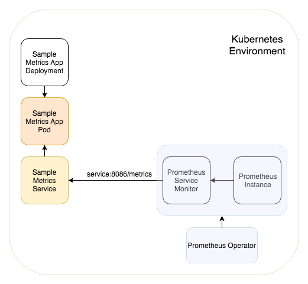
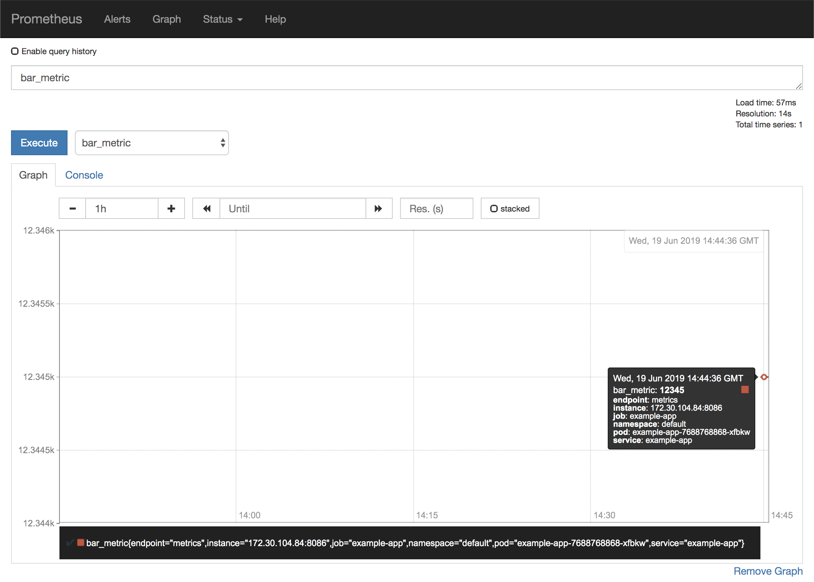
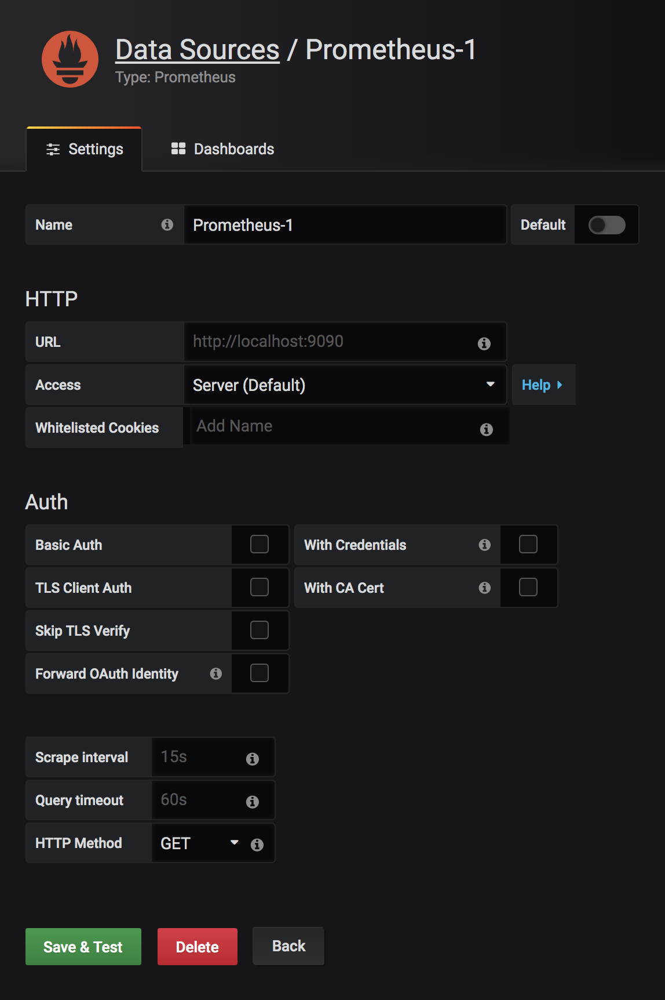

# Monitoring Application Workloads on Kubernetes with Prometheus

## Architecture



This document makes use of the Prometheus Operator. The Prometheus Operator for Kubernetes provides easy monitoring definitions for Kubernetes services and deployment and management of Prometheus instances. You can read more about this operator and its components [here](https://github.com/coreos/prometheus-operator).

## Getting Started

To get started with using the Prometheus Operator, run the following command in your desired Kubernetes environment (this will deploy resources in your default namespace unless otherwise specified)

`kubectl apply -f https://raw.githubusercontent.com/coreos/prometheus-operator/master/bundle.yaml`

This command will create some Kubernetes resources that will now allow you to easily create Prometheus related custom resource definitions (CRDs) in your environment.
```bash
$ kubectl get all

NAME                                       READY   STATUS        RESTARTS   AGE
pod/prometheus-operator-6bcdd5557f-fzk55   1/1     Running       0          19h

NAME                          TYPE        CLUSTER-IP   EXTERNAL-IP   PORT(S)    AGE
service/kubernetes            ClusterIP   172.21.0.1   <none>        443/TCP    45h
service/prometheus-operator   ClusterIP   None         <none>        8080/TCP   19h

NAME                                  READY   UP-TO-DATE   AVAILABLE   AGE
deployment.apps/prometheus-operator   1/1     1            1           19h

NAME                                             DESIRED   CURRENT   READY   AGE
replicaset.apps/prometheus-operator-6bcdd5557f   1         1         1       19h
```

## Capturing Application Metrics

Prometheus has a lot of community support with plenty of [built in integrations available already](https://prometheus.io/docs/instrumenting/exporters/).

Of course, custom applications will require custom metric exporting. Luckily Prometheus has [exporting libraries](https://prometheus.io/docs/instrumenting/exporters/) for several popular programming languages such as Golang, Python, Node.js, etc. The following sections of this document will briefly outline what a custom implementation would look like.

## Capturing Custom Application Metrics

This document imagines that our custom app logic is written in [main.go](./main.go) and a Docker image was from its respective [Dockerfile](./Dockerfile). Assume that this Docker image was also uploaded to some image repository with endpoint `<your_container_image_link>`.The `main.go` file is a very short file that starts an HTTP server and then defines and exports our custom metrics `foo_metric` and `bar_metric` as variables for Prometheus to monitor at the `/metrics` path on port 8086. In this code, we give `foo_metric` and `bar_metric` dummy values of 54321 and 12345. In your custom app you will likely be updating your own metrics values as certain events or conditions are met instead of keeping them at static values like our dummy `foo_metric` and `bar_metric` metrics.

We can then run the following command to create our expected resources.

`kubectl apply -f example-app.yaml`

As seen below, this command will create an 'example-app' deployment and its associated service, a ServiceMonitor resource, a Prometheus resource, and the appropriate RBAC permissions needed for Prometheus to operate.

```bash
$ kubectl apply -f ./example-app.yaml

deployment.apps/example-app created
service/example-app created
servicemonitor.monitoring.coreos.com/example-app created
prometheus.monitoring.coreos.com/prometheus created
serviceaccount/prometheus created
clusterrole.rbac.authorization.k8s.io/prometheus created
clusterrolebinding.rbac.authorization.k8s.io/prometheus created
```

What this `example-app.yaml` does is that it essentially creates a service that exposes the `example-app:8086/metrics` endpoint which the ServiceMonitor then listens to and writes to Prometheus.

To view the Prometheus dashboard you'll need to expose the resouce as outlined [here](https://coreos.com/operators/prometheus/docs/latest/user-guides/exposing-prometheus-and-alertmanager.html).

You can alternatively just make use of Kubernetes' port forwarding option as shown below.

`kubectl port-forward prometheus-prometheus-0 9090`

This command will allow you to view the dashboard at `localhost:9090`.
Visiting this endpoint will allow you to view your `foo_metric` and `bar_metric` data points.



## Plugging into Grafana

Grafana supports Prometheus as a native data source which allows for easy integration between the 2.


The URL provided will depend on where your Prometheus and Grafana instances reside. If they are in the same Kubernetes environment then you can expose Prometheus as a service and define the URL field as the service name and port. i.e. `prometheus-service:9090`

If they are in different environments then you will have to expose the Prometheus instance as mentioned in the previous section and use the exposed endpoint as the URL in the data field.

## Useful Links
[Official Prometheus Documentation](https://coreos.com/operators/prometheus/docs/latest/user-guides/getting-started.html)

[Prometheus Operator Tutorial 1](https://sysdig.com/blog/kubernetes-monitoring-prometheus-operator-part3/)

[Prometheus Operator Tutorial 2](https://devops.college/prometheus-operator-how-to-monitor-an-external-service-3cb6ac8d5acb)
